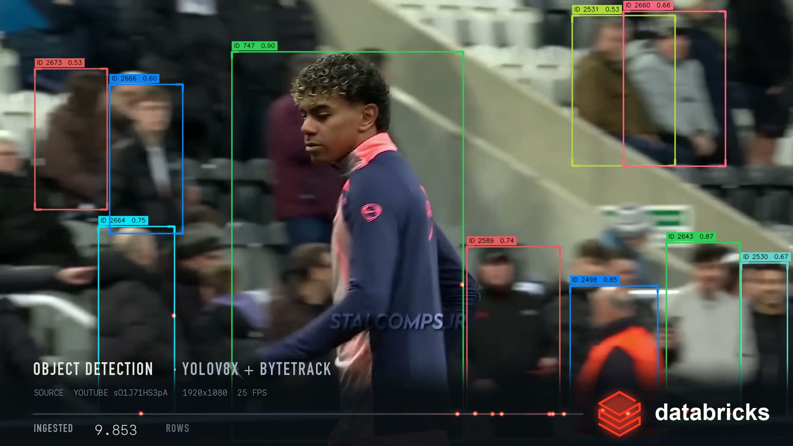

# Football → Lakehouse

Turn one minute of broadcast football into 13,600 rows — and watch every one
of them fly off the pitch into a data pipeline.



YOLOv8x detects every person (and the ball) in every frame; ByteTrack stitches
identities across time, and each track gets its own colour. Every detection is
one row — frame, track_id, class, confidence, four coordinates — and each row
emits a particle that falls off its bounding box onto a conveyor line, runs
right, and is absorbed by the mark at the end of the pipeline, which pulses on
every arrival. A live counter tallies the rows as they land.

The counter is not decoration: it matches `detections.csv` row for row. The
run behind the cover frame is in [`sample_output/detections.csv`](sample_output/detections.csv)
— 13,600 rows, 594 tracks, 60 seconds of one camera.

## Why two passes

Inference is expensive and the visual treatment is not. Splitting them means
you can iterate on the look without re-running the model.

| Pass | Script | Does |
| --- | --- | --- |
| 1 | `extract_track.py` | YOLOv8x + ByteTrack once, caches rows to `.npz` + `.csv` |
| 2 | `render_yolo_pipeline.py` | Draws boxes, particles, conveyor, counter |

## Setup

```bash
pip install -r requirements.txt
```

`yolov8x.pt` downloads itself on first run (`--model yolov8n.pt` if you want
fast over accurate).

`--logo` takes any PNG with an alpha channel. This repo intentionally ships
without one: if you want the Databricks mark, get it from
[brand.databricks.com](https://brand.databricks.com) and follow their trademark
guidelines. Any other mark works just as well — `--wordmark` sets the text
drawn next to it.

The HUD uses DIN Condensed and SF Mono, which ship with macOS. On Linux the
scripts fall back to DejaVu/Liberation, or point them anywhere you like:

```bash
export POSE_FONT_DISPLAY=/path/to/condensed-bold.ttf
export POSE_FONT_MONO=/path/to/mono.ttf
export POSE_FONT_WORDMARK=/path/to/sans-bold.ttf
```

## Run it

Grab a clip. Broadcast footage isn't redistributable, so bring your own — the
cover was rendered from the first minute of a Lamine Yamal VIP-cam video:

```bash
yt-dlp -f "bv*[height<=1080][ext=mp4]+ba[ext=m4a]/b" \
    --download-sections "*0:00-1:02" --force-keyframes-at-cuts \
    -o clip_raw.mp4 "https://www.youtube.com/watch?v=sO1J71HS3pA"
ffmpeg -i clip_raw.mp4 -t 60 -r 25 -c:v libx264 -crf 18 -c:a aac clip_60s.mp4
```

Cache the detections, then render:

```bash
python extract_track.py clip_60s.mp4 detections.npz detections.csv
python render_yolo_pipeline.py clip_60s.mp4 detections.npz render.mp4 \
    --logo mark.png --wordmark yourbrand --source-label "YOUTUBE sO1J71HS3pA"
```

The renderer writes silent video; put the stadium back in at the end:

```bash
ffmpeg -i render.mp4 -i clip_60s.mp4 -map 0:v -map 1:a \
    -c:v libx264 -crf 18 -pix_fmt yuv420p -movflags +faststart -c:a copy final.mp4
```

## Knobs worth turning

- `TRACK_COLORS` in `render_yolo_pipeline.py` — the per-track palette. Red is
  deliberately absent: it's reserved for the pipeline accent.
- `conf` / `imgsz` in `extract_track.py` — detection floor and inference size.
  1280 helps with far-side players; 640 is twice as fast.
- `LINE_Y`, `ICON_CX`, `ICON_W` — conveyor and mark geometry.

## Known limits

- Track IDs churn: broadcast camera cuts and heavy crowd occlusion restart
  identities, so a one-minute clip yields hundreds of track IDs, not
  twenty-two. ByteTrack has no idea what a substitution is.
- The ball is small, fast and frequently airborne — expect sparse ball rows
  (351 of 13,600 in the sample run).
- Geometry constants assume a 1920×1080 frame.

## License

MIT
